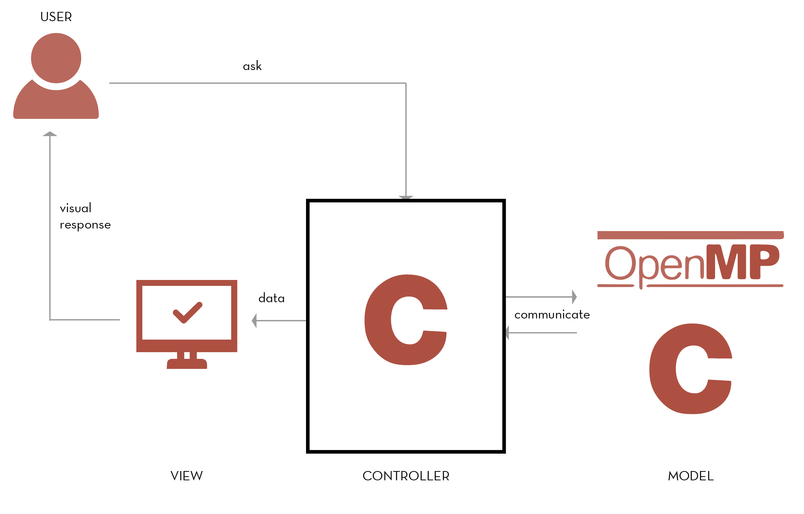

MVC Architecture
=========================
Our implementation of a multithreaded version of the video game [Snake](https://en.wikipedia.org/wiki/Snake_(video_game_genre)). This version is a Computer vs Human game. Each enemy is independent and the number of enemies is configurable.

We used the MVC - Model View Controller Pattern. It isolates the application logic from the user interface layer and supports separation of concerns. The Controller receives all requests for the application and then works with the Model to prepare any data needed by the View. The View then uses the data prepared by the Controller to generate a final presentable response. The MVC abstraction is made up by three parts and can be graphically represented as follows: 

Model 
----------------------
Model represents shape of the data and business logic. It maintains the data of the application. Model objects retrieve and store model state in a database.

View
--------------------
View is a user interface. View display data using model to the user and also enables them to modify the data.

Controller
------------
Controller handles the user request. Typically, user interact with View, which in-turn raises appropriate URL request, this request will be handled by a controller. The controller renders the appropriate view with the model data as a response.

OpenMP
-------------------------------
Multithreaded core backend. 

We used OpenMP for the multithresded core backend, OpenMP is an application programming interface (API) that supports multi-platform shared memory multiprocessing programming in C, C++, and Fortran, on most platforms, instruction set architectures and operating systems, including Solaris, AIX, HP-UX, Linux, macOS, and Windows. It consists of a set of compiler directives, library routines, and environment variables that influence run-time behavior.
